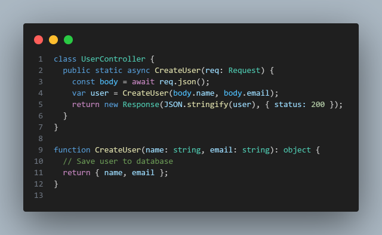
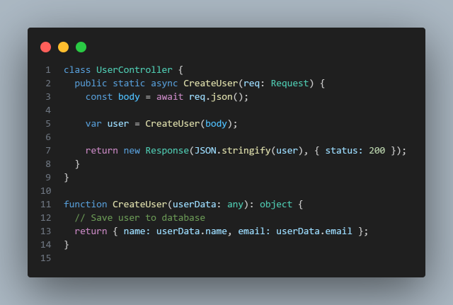
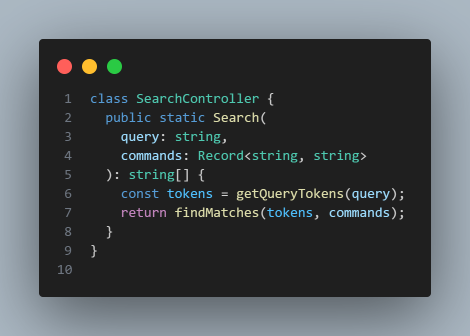

# Development Practices

## When Should You Perform A Major Refactor?

I am not a big fan of major refactors as a rule.

I usually find that the core issues in the code can
be fixed by "boyscouting" the issues you have in each
delivery. By doing so you fix the mindset of the developers
and you don't have to stop feature development.
Too often I see developers cry for big refactors and yet
those same developers never even try to fix smaller things
that they could fix easily.

However, let us assume that we do have a good set of developers
who really do their best to boyscout code. In this scenario, I
find that major refactors are needed when the overall architecture
is wrong. An example of this would be that the data model is not right
for the domain.
If the data being stored is not a good reflection of the domain, all
other logic has to account for it, which usually causes bad workarounds
and bugs.
As many professional developers know, changing a database schema for
a large domain has many challenges and it is hard to do it little by
little. Especially if you can't do something simple like a batch schema
update by taking down the system for some maintenance.
There are of course alternatives to this approach but I think it is
a good example of a task that is easiest done by a big one time investment
that may be worth doing instead of dragging it out with the boyscouting
approach.

In short, big refactors should not be your first thought. Your first
thought should be to ponder if you can create a plan with your team.
That plan should consider if you can make small changes in each delivery
that over time will solve your problem. It is a bit like a fitness
schedule. You just need to stick to the plan and you will lose legacy
code.
If however, you find an obstacle where there is no way to boyscout,
it is after all very hard to boyscout a database schema, then you
may want to consider a big refactor.

## How To Write Integration Tests That Aren’t Flaky?

The best way I know, is to write integration tests that
can run in a stable environment and with stable values.
Flaky behaviour usually comes from things like race conditions
and unrealiable systems external to your code.

Take time as an example. Timestamps are a common thing in many
programs and they can be hard to write tests for. The tricky
part about writing tests for timestamps is usually that time
keeps changing. So how do we fix that? Well, the simplest way
is to not do exact assertions on timestamps and instead allow
for a small amount of error margin so the test won't fail if
the difference between two timestamps is just a few milliseconds.

Another worthwile consideration is for functions using time internally.
Instead of creating a timestamp inside the function, pass it as a parameter
so the caller can control the time value. If your langauge supports
default parameters, I find it nice to use a default value so the test
can override it when needed.


When we are dealing with external system, it is in general a good practice
to remove unstable elements by mocking network calls we may not need.
However, we must take care when mocking so we don't end up mocking
away the code we want to test.
In some cases we don't want to mock and instead we want to create
a local setup that we can run. A good example are databases. We want
to make sure that our queries to the database are working but we don't
want to connect to external services. So what to do?
My person preference, and I assume many others, is to use a local
database that starts up with the tests and is then shut down after
the tests are done running. Even though this is not a perfect test
that accounts for the things that could be wrong in a production
environment, it is still close enough.
Sometimes close enough is the better option to pick than having to
deal with the problems that come with exactly the same.

## Are Unit Tests Effective As Regression Test Suites?

In of themselves, no. Combined with the layers commonly found on a
testing pyramid, yes.

I often see developers struggling to understand testing. They write
some basic unit tests and call it a day. However, I argue that if
you don't understand that the test you write depends on the code,
then you haven't really understood why you are writing tests.

Unit tests make a lot of sense to write if you are afraid that the
function you have made will have a bug in it. They make no sense
at all if the function isn't doing anything that can go wrong.
They make no sense if the code you have is just connecting to an
external API to fetch some data. We can of course make an argument
for that checking the url or possible input parameters being added
to the request body can be a unit test but I hope we can agree that
the most risky part of an external API call is that the API returns
the wrong data.
Testing that is best done with an integration test since we want to
be sure that the request actually works.

Always focus on what can go wrong when making tests. Having unit tests
does not mean that bugs will be caught. Having the right test for the
code you have made will.

## Why Do Seniors Sometimes Use Complex Code Instead Of Simple Code?

The two main reasons is usually that either, it is just the way
they feel at the moment or there is no simpler way to do it.

Senior developers are like most of us, human. Humans get bored, they
forget that what to them is a cool idea is legacy code to the next
developer who has to fix their mess.
Ponder yourself how often you see people getting excited by their
amazing idea and in their excitment they forget to consider if
their idea will have any negative impact on others around them.
Seniors are no different.

On the off-chance that we do have a valid case for some complex
code, however we want to define that. I am just going to point
out that complex is a bit subjective and can mean literally
anything. What we consider complex can differ vastly from person
to person but in general, complex code may be the lesser evil
at times.
At times we simply find that a complex solution is the best way
to solve a given problem. As an example, searching. Depending on
what type of search our customer wants to perform, we may find
that we need multiple types of result filters, different type of
boolean flags that impact how the search is performed and so on.
Simply put, a beginner friendly regular expression or string
comparison will not be enough to meet the stakeholders needs.
So we have to make our code complex, even if we would like it to
be simpler.

A good rule to follow, make code as complex at it has to be but
never more.

## What Techniques Can Help Simplify Code?

My personal mantra is to divide and conquer. If we are dealing
with a big problem our best bet is usually to split it in to
many smaller problems and then order each piece as a step by
step process. This allows us to focus on getting the first step
in our program right before we need to think about the next part.

My functional friends can hopefully relate when I say that I would
love it if all my coworkers structured their code as a list of pure
functions that I can follow until I find an unexpected output from
one of them. This means that now I can forget about most of the code
and just zero in on that function.

I follow the same principle when I am debugging. My first goal
is to remove all factors that can cause the bug. If I am working
with an IDE, use a text editor to make sure the problem is not in
the IDE. If I am getting an error while using the UI, try connecting
with a network client. Having problems in a environment? Try locally
and vice versa.

As you work you will develop an intuition for how to divide big issues
in to smaller ones and before you know it, you find it odd that most
people just see big problems when all you see is a simple first step
that then leads to a simple next step.

## Does “if It Isn’t Broken, Don’t Fix It” Apply To Software?

Yes, very much so. Though as with many sayings, there are
nuances that get lost in translation.

There is a lot of development that happens mostly due to the
emotions of whoever is involved. The term legacy code can often
mean any code that the reader didn't write in their own style.
So I usually ask them, is the code bad because it is different
or will it actually cause any bugs? Viewed from such a perspective
our idea of what good code and bad code looks like should change.
We love to put those labels on most things in life but if we are
really honest, most of the time we are just expressing what we
would prefer.

However, we can of course flip this argument around and use this
saying to justify never fixing anything in our code. This seems to
many to be the default state of their stakeholders. If the code is
working, why do you need to refactor? Well dear sir or madam.
Because working on this projects is just slightly better than
listening to someone grind a fork against a chalkboard. When I push
something to production, I feel the need to say a small prayer to
any diety willing to listen. Lastly, all those late nights I have had
to wake up to fix production issues are starting to wear me down so
perhaps we can discuss what you mean when you say that the system
isn't broken.

## Do Coding Best Practices Vary Between Companies?

Yes, sometimes it differs between person to person.

Best practice is something some developers like to
throw behind any argument they pitch for their own
preffered way of doing something.
There are certainly best practices that most of us can
agree on but there are also best practices that seem to be
directly opposing eachother.

Then we have to interpretation of these best practices.
How do we know who among us has the right idea of what
DRY means? If you ask a room of developers to define
this practice, most of them will be able to give some
general deffinition. However, if we start going in to
the nitty gritty details, usually they start having
different ideas about how to implement this practice
in code. Let alone when the adherance to this practice
becomes a code smell instead of a best practice.

The best advice I have ever heard on the subject is
as follows. The tech gurus are not in your team,
they are not writing your code. Your coworkers are.
Winning a battle of who has the right idea of what a
best practice means is useless if your end up getting
fired because people are sick of endless debates about
best practices.

## How To Prevent Bugs In Software Development?

This is a very broad topic since bugs can happen
in many ways. I will try my best to outline a few
general techniques I use that I feel are working.

First, learn how to write the right test for your
code.

Second, learn how to break free from primitives.

Most developers learn how to write code in the
style taught by their very first tutorials but
they seem to never outgrow this idea that the
style they used to learn how to code, may not
be the best way to write code always.

To give an example, let us consider the following
code.



Now, glossing over the security issues with this
code, we can see that it follows a general pattern
we all have seen in many codebases. It is simple,
we get a value from the network and we store it.
However, the problem here is that we are not sure
if the values are valid.

Now let us introduce some basic validation.


Again, nothing really wrong with this approach.
However, if we start introducing more logic with multiple
calls to various functions across a large codebase, we will
start to see misstakes being made. One of the most common bugs
I have faced is i.e down to the data being incorrect at some
state of the program. We can remove a lot of issues if we update
this code slightly.


If we convert our input data to a class, we can trust that our data
is already validated by the time any other logic wants to use it.
This removes the issue where the data is in an incorrect state before
we start working with it.

This slight change in coding style has helped me remove a large amount
of bugs from my projects. Even if I am passing the data around I can
always trust the data in a validated class.
Primitives do not give this security and most developers try to
fix it by simply adding validation in all the functions using the data.
This approach is in my opinion, a bit cleaner.

## Can Automated Testing Replace Code Reviews?

No, code reviews are a compliment to tests.

The basic idea behind a code review is that we want
someone other than ourselves to review our code for
issue we have failed to spot. In theory that is how
it should work but in practice the value of a code
review is down to who is doing it, if they care enough
to do a thourough review and of course, if they can spot
issues we did not.

If I write code and then test it, I will approach it from
an angle that makes sense to me. However, I can still forget
to write tests for cases that can cause bugs or I can write
bad tests that don't catch the bugs. This is where a second
pair of eyes will be more useful than just having tests. Those
eyes should hopefully be able to spot that I forget to test
my code for certain cases, thus prompting me to expand my
thinking and adding the tests I forgot.

It is also common that a code reviewer finds that I may have
missunderstood the acceptance criteria for the work I am doing
and that my whole implementation is wrong. It is not fun to be
in that situation but I hope it shows that automated tests can
prove that the thing I did is working as expected. It can not prove
that the thing I did is the right thing.

## Do Unit Tests Take As Much Time To Write As The Logic Itself?

Sometimes they can but the time it takes to write them is usually
lower, with one exception few seem to consider. Lack of practice.
There is a saying in programming, if your code is hard to test
it is not good code. To a point I can agree with this.
I find that developers who struggle to write test mostly do so
due to a lack of experience with workflows that include them.
This is extra true in frontend development. Very few frontend
developers have any meaningful experience writing tests so
it usually takes them nearly as long to test their code as
making it in the first place.

Fortunately we have moved in to an era of AI agents and writing
tests have never been faster. I still suggest that developers
take the time to learn how to do it properly.
It will help you a lot if you understand how to write the right
test for the code you have and you will spend less time dealing
with bugs in the tests if you practice a bit.

## How To Improve The Software You Develop?

I follow a few basic principles that has helped
me write better code, at least that is what I want
to believe.

My main rule is, always understand the problem you are solving.

It is very important that you connect with your stakeholders
and ask them to explain what they want from you, how they want
the system to work and why they need the features.
By making sure you understand their needs you should be able to
use your technical knowledge to come up with proposals for how
to implement said features.
Never start working without understanding the problem you are
solving. You will find that your implementations start falling
apart over time. I like to say that working on a system is
like laying a brick road. Each brick is a feature and together
they make up the road. Your goal is to know how to add a new
brick each time so the road stays smooth and heading in the
right direction.

## How Much Upfront Design Should You Do?

A good rule of thumb is to at least have some basic
visual aids of the UI. Assuming of course that you
have a UI.
If you can visualize the experience you want it becomes
easier to create a shared understanding of how the system
should work. I almost always start UI first. The main reason
is that by seeing the experience I am making I can roughly
estimate what data models I need and how the backend part
of the system needs to work.
I advince against starting by modelling the data before you
understand the experience you are creating. Too often I see
developers create a data model that is a poor fit for the
experience and then they end up adjusting the user experience
to fit their implementation instead of making sure their
implementation is right for the user.

Apart from this rule I urge you to think in incremental steps.
It is hard to predict a large scope when making systems so if
you find yourself planning work, try your best to break it down
so you only need to answer what the first logical step is.
If you can get a rough idea of what the end product should be
you should be able to figure out what the first step to create
that end product is. Plan that step and no more.
This is the heart and soul of a MVP workflow and I believe it
is the right way to make anything.
By starting with creating a basic version of a feature you will
learn more and when it then is time to take the next step you
will have more information to go on than if you had tried to
plan it all before there was any code at all.
My tip to you is to master this process. Learn how to create a
first draft of a bigger project that will be easy to continue
working on when it is time to take the next step in the development
process.

## What Advantages Does Test-driven Development Offer?

The general idea is that it helps us be honest about the test
we create.
When developers write test, some have the bad habit of writing
tests that act as whitebox test. This basically means that the
test is just checking that the implementation they have made
is working the way they wrote it.
However, this is not have a good test should be structured.
It will break as soon as something changes about the implentation
and that is not what we want. We also don't really want to test
that our implementation works a certain way.
What we want to test is that the logic is working correctly.
By doing TDD we can make sure our test prove that the logic
is working without knowing the details of just how the logic
works. As a tester we just want to make sure that the results
are correct but the hidden logic behind the abstraction is not
really important. As long as we have checked all the things we
think can go wrong and the different results we expect to get,
we have a working solution.
This idea is true for all layers of the testing pyramid and
TDD is a great way to make sure our tests are checking that
the logic is correct and not that the implementation works
the way we wrote it. After all, if our logic is wrong and
all our test is checking is that it is doing the logic,
our test will pass but we still have a bug.

It is worth mentioning that you can achieve this sort of
test without strict TDD. TDD just helps you be honest about
your test creation so they are focused on that the abstraction
meet the users expectations. However, you can write tests after
the implementation is done with the same mindset if you do it
with some care.

## Why Have Software Teams Abandoned Upfront Design?

I don't think they have fully. What has for the most part
been abandoned is a lot of the rituatl surrounding the
design process. UML diagrams and similar documents are
less common in the part of IT I have worked than they
used to be.
As to why that is, I suspect it has to do with that
developers have with the agile methodolgy been
placed closer to the stakeholders and thus removing
the need for a lot of the roles that we used to have.
Architects and similar roles are of course still around
but the style of work has moved from a waterfall flow
to instead focus on iterative deliveries.
It is probably no secret that most companies mix both
the agile and waterfall elements as they see fit but
at the team level most developers are focusing on
quick results, which very naturally means no upfront
design, just start coding.
At a macro level it is still common that managers want
some high level system design so things like architecture,
security and of course cost of the system can be considered.

## Are Architecture Decision Records Useful?

It depends a bit on when you make them.
To me the best way to make an ADR is when you have
made decision that will reach further than one team.
You can of course do it for a single team but usually
you won't benefit as much from the rituals surrounding
an ADR. The big benefit in my view, is that with an ADR
you can create a collaboration between multiple teams
on a decision that will impact all of them.
This is very important, since you really want to make
sure that each team shares a common vision of how to
implement their part of the decision being made.
It is very common to see fragmentation in large companies.
This fragmentation means that you often find teams doing
duplicate work, creating multiple standards and of course,
building systems that vastly differ from eachother.

ADR's are a perfect way to make sure that each team can
share how a decision will impact them and since there is a
record you can keep track of, you can keep track of it.

I urge you to adopt this principle and even to some lesser
extent in your own teams. If you then leverage AI tools, you
can reduce some of the mistakes that often happen during development.
Those documents that used to be parked in some unknown document
storage system can with AI become truly useful.

If you want to take it one step further. I recommend that you invest
in static analysis tools such as linters or source scanners that can
use the ADR's as reference material to validate that the code is
following the agree upon standards.

## What Is The Trade-off Between Fast And Planned Development?

Fast development seems like a biword for bad code to many.
My view is that it always depends. Planned development, as
the term suggest, takes more time. So when do we care about
potentially raising the quality of our work by planning things
out before we start working? Well, I argue that even if we plan
our outcome is determined by the talent of the developers.
No amount of planning will help if the people involved don't know
how to execute effectively on the task they have ahead of them.
Too often do I see endless Scrum rituals and meetings amount to
nothing more than a lot of wasted time without any measurable
benefit.
However, fast development, as almost all developers like to
complain about, leads to tech debt and legacy code.
The notion being that if we work fast we will do worse than
if we work slow.
I argue that this is logic is flawed. Truly talented people
will be fast by default without necessarily making worse work.
That is how some humans are able to run faster than others
even if both are training hard. We perform at different levels.

If we can agree that the idea that fast is worse than planned work,
then we can look at what I argue are the best examples of the correct
application of these two styles.
Rappid development without much in terms of prep work is the natural
default for projects where the problems being solved feel obvious to
the team doing the work. It makes no sense to plan out something that
you already understand how to do. Naturally, you could forget something
that a plan would have caught but as I mentioned earlier, planning
does not necessarily mean that you will think about all corner cases
and you may end up with the same mistakes, plan or no plan.

I argue that planning is most important when you are dealing with
an issue that requires you to create a shared understanding of
something that is complex. Taking your time here is important since
if you get it wrong, you will lose even more time from issues that
spring up due to overlooked details.

My mantra when working with development teams is this, "we should all
have the same picture of what is to be created in our heads".
This means that depending on the people I have in the team and the
problem we are solving, I may opt for more planning to make sure each
members has truly understood what to do. However, if I can tell that
the solution is obvious to the people involved, we just get on with
it.

## How To Balance Perfectionism And Pragmatism In Software Development?

This is probably the hardest question there is to answer in any craft.
When do you say "stop, this is good enough"?

I argue that the trick to getting it right is to truly understand then
need of the people you are building for. What will they value most?
By being honest about this you can start to think about if they truly
care about some minor library that does something nice or if they would
prefer to have the code a bit earlier? Then you can think about how
they would like it if the system was really buggy.

The core of this idea is that you are always able to go to the extreme
with any concept, be it high quality or none at all. I argue, that
to get the right level of quality, you need to understand the consumer
well enough to know what will matter for the end product.

The car industry has this down. Some manufacturers build high end luxury
cars, because they have customers with the purchasing power to afford
them. Other manufacturers focus on customers with more modest purchasing
power and naturally, their choices in materials, features and so on
will need to be more modest to fit the price range of the customer.

As software developers, and in fact, any craftsman you should know
where the sweetspot is for anything you make.
By mastering your craft you will be able to see where you can make
pragmatic decisions that will not be noticable to the customer.
You will learn when to be extra mindful of your choices and when
you can opt for a simple and fast approach.
The trick is to understand that depending on the system and the
customer it will vary but one thing is almost always true.
Nothing we make needs exactly the same level of quality to give
value to someone, your approach should be to figure out what parts
matter most and what matters least.

It takes a true master craftsman to create high quality work even
when the product is cheap.

## What To Do When Fixing A Production Problem?

My approach is to narrow the scope of the issue.
This basically means that I remove factors that can cause the problem
until I have narrowed it down to the smallest scope I can.
Since we are dealing with a production issue, the first move is to
understand if the problem is just in production or if it can be replicated
locally or in some other development environment.
Figuring this out gives us a more narrow scope. If the issue is just
in production, we know that we need to consider how production differs
from the other environmets.
If the problem exists in all environments, we know that we can use
our non production environments to be more aggressive in our debugging
than we could in production. Assuming of course that production debugging
would impact our customers.

Using tracing tools and logging effectively is important when dealing
with environment issues. They are your window in to what is going on
in the system. My personal favorite logging strategy is to treat debug
logs as a way to understand what data is coming in to my abstractions
and what data is leaving.

Below is an example of a common piece of code in a web application.



Let us pretend that we had an error in production with this code.
We would be flying blind mostly since we don't have any way of knowing
if the problem is the data input, the saving of the data or possibly
what is being returned.

With some slight updates to our logging strategy we can get a pretty
clear picture.


This is just an example but I hope the idea is conveyed. If we think
about our application as just a tree of function calls, we can almost
derive what has happened by just knowing what the values are at each
step of the callchain.

Depending on our langauge and framework we can improve on this to make
is slightly less repetative.


The same principles can be used in any language. If we can structure
our debug logging as a way to track what data is coming in and leaving
our abstractions, it becomes simpler to narrow down if the data or
the logic is the problem.

Lastly, it is very important that we understand how to exclude other
factors. I see developer have issue with their IDE's, thinking they
have a bug in their code when it is just the IDE that is acting up.
The same is true for connecting to production environments.
Make sure you can figure out if you are talking to your own server
or a proxy. All to often I see developers bang their head against
their desk, trying to understand why their debug code isn't showing
in their logs. The problem is often that their requests are not
being forwarded as expected by a proxy server. As a rule, make
sure you have an easy way to track what server is responding
to your requests. It will help narrow the scope even further.

## How To Create An Architecture When Requirements Constantly Change?

Simple, account for it.
This may seem obvious but more often than not do I see development
teams struggle to understand how to create an architecture other
than the one they where taught in school or on their first job.
I have a similar observation when it comes to using primitives in
the code but we will cover that in another question.

My basic argument is, developers who know how to create loosely
coupled code, know how to scale any system, no matter how much
the requirements change. The reason being, that they design the
system so that the cost of changing it is low. The biggest mistake
you can make in view, is to try to make your abstractions too
generic or too flexible too early. As features are added and
requirements change, you will more often than not, find that
your abstractions start to grow in complexity.

Rather than trying to be generic, I suggest you think as code
being disposable. The key difference is that when things change,
you should not focus on what code you have commited to but rather
focus on what the best solution right now is.
As a rule, developers view code as an investment and if you make
a bad one, most will just continue to add to it. Here is where
the difference in mindset lies. If we can only ever add to our
code without ever removing, we need to create complex abstractions
that grows forever. However, if the cost of removing code that no
longer is needed or that has changed so fundamentally that it is
no longer a good fit for our requirements is low. Then why not just
keep complexity down and rewrite?
Big rewrites are usually the outcome of having code that can not
be changed as a small unit of a greater whole.

One of my favorite patterns that gives a practical example of this
idea of "disposable code" is a flavour of the modular monolith.
Frankly speaking, I never liked the term because I always associate
the style of it I use as the "kernel pattern".

Let us assume that we are making a project that is to handler orders
of some arbitrary product. Our most natural entities in such a system
would probably, users, products and orders.

A textbook example of an architetcture for such a system would be a
monolith using some flavour of the MVC pattern.

```text
src/
  controllers/
  models/
  services/
```

If we not add in our files it may look something like this.

```text
src/
  controllers/
    UsersController.ts
    ProductsController.ts
    OrdersController.ts
  models/
    UsersRepo.ts
    ProductsRepo.ts
    OrdersRepo.ts
  services/
    UserService.ts
    ProductService.ts
    OrderService.ts
    EmailService.ts
```

Different languages and frameworks would have some variation of this
approach but it is a pattern that many would feel familiar with.

Our dependency graph will look something like this.


So what is the problem with this approach? Well, nothing really.
It is a tried and true pattern that most developers will feel
comfortable with, regardless of their experience level.
However, this pattern fell out of favour due to the tendency
it has to create "spaghetti code". In this simple example we
have no issues since the system is small. Now scale it up 100
times and add multiple teams with varying degree of skill on
top. What we quickly find is that our architecture has no strategy
for segmenting logic so that we avoid complex dependency graphs
between our files.
As the system grows we will find that a large portion of our code
is coupled in not so obvious ways and due to the fact that we
have large amounts of it, it is nearly impossible to predict
how we should change it so we can account for changes in requirements.

A method that I would argue is more in line with the idea of disposable
code would look like this.

```text
src/
  users/
    UsersController.ts
    UsersRepo.ts
    UsersService.ts
  orders/
    OrdersController.ts
    OrdersRepo.ts
    OrderService.ts
  products/
    ProductsController.ts
    ProductsRepo.ts
    ProductsService.ts
```

This structure focuses on moving all the logic that is connected to
a given controller to the same folder. This means that as the system
grows, complexity can grow in a folder, legacy can impact a folder
but the seperation of logic segments our code so that it does not
spread across the whole system.

Naturally someone will ask, but what about shared dependencies?
Well, the pattern continues in the same manner.

```text
src/
  users/
    UsersController.ts
    UsersService.ts
  orders/
    OrdersController.ts
    OrdersRepo.ts
    OrderService.ts
  products/
    ProductsController.ts
    ProductsService.ts¨
  shared/
    EmailService/
    UsersRepo/
    ProductsRepo/
    ...
```

Here we see a common set of shared code in this sort of system.

Now our dependecy graph looks like this instead.


I have found this structure to be easier to work with since I know
that I can add and remove code as needed without needing to consider
the system as a whole. A shared dependency is just that, code that
is shared between more than one folder.

The pattern can continue in to subfolders as well.

```text
src/
  users/
    modules/
      admins/
    UsersController.ts
    UsersService.ts
  orders/
    OrdersController.ts
    OrdersRepo.ts
    OrderService.ts
  products/
    modules/
      cars/
      bikes/
      shared/
    ProductsController.ts
    ProductsService.ts¨
  shared/
    EmailService/
    UsersRepo/
    ProductsRepo/
    ...
```

Each level simply need to hook in to the parent when it starts up
with the server.

To finish up, we can now treat our project as a collection of
modules. These modules can run on their own server or in the
simplest case, we can do this.


In summary, if you account for that you may need to change your
code in ways that is hard to predict, you can plan for it.
If you design your architecture to allow individual pieces of
the system to not be perfect without damaging the whole system,
you are in a good spot. It is a bit like a saying used by the
datacenters around the world. "We know that something will break,
so we plan ahead and make it no big deal if it does".
Use the same mindset in your architecture. You know that you will
get legacy code sooner or later, so plan for it.
Isolate the code so a small portion of it can grow while keeping
the rest simple. If the growth turns in to legacy, at least you
don't need to throw away the whole system.

## Why Do It Companies Prioritize Speed Over Quality?

Quality is subjective. It is probably the most common area of
friction between developers and their stakeholders.

As software developers, we probably have the highest criteria
of anyone when we discuss quality. The reason being, we know
what is possible and many of us care about our craft.
We take pride in it. So if our system is fully of issues and
we are forced to just maintain the mess without cleaning it,
we get upset.
However, from the users perspective, the system may be filling
their needs. To them the issues we feel are important don't
cause much impact so it is hard for them to relate to what we
say when we speak about refactors and quality.

There is one thing worth mentioning though. We may not feel that
our company cares about quality but as I have mentioned, they do,
but perhaps less than the developers. However, no company cares
so little that if core features are not working, they will turn
a blind eye to it.

The best way I can describe is like this. Imagine that you are a
boat builder and we are taking a journey over a lake to visit an
island. Your partner who is not a boat builder asks you to help
get the boat in the water so you both can cross. You notice that
the boat is full of leaks. As the boat builder you are, you feel
that this needs to get fixed. Your partner tells you that it is
fine becuase crossing will not be an issue, even with a leaky
boat. If you want to fix the boat you would need a whole so big
that crossing would not be possible if you wanted your partner
to agree with you.

Business works for the most part this way. The focus for the
company is to make money and as long as the quality is good enough
to keep making it, very little else matters. Fixing quality issues
is always a cost vs value problem where taking time to fix issues
has to be more important than making new features.

## Should Developers Have Emotional Attachment To Their Projects?

To a point but I would rather have them have an emotional attachment
to their craft.
I know that for some loyalty and commitment to the goals of the project
is an important merit to have but I have always view this as a bit
of a one sided notion.
Companies are a business and a business will always need to be most
concerned with it's own survival. There are of course degrees to this
where we often see ethically questionable decisions being made by
companies that isn't really about survival but rather about enriching
some at the expense of others.
However, as an employee working on a project, we should remember that
our commitmend should stand in proportion to what we have agreed to
with our employer. In other words, you owe the company good work and
not actively seeking to harm it with nefarious activities.
More than that should be a tit for tat agreement, if you ask me.

I prefer to say that my emotional attachment is to the quality of my
work. I want my employer to feel safe in that when I do a job for them
they will get good results, they can trust me, they can talk to me
about their concerns and I will do my best to help them.
However, I am still selling my time and if someone else offers me a
better deal for that time, I expect my employer to match it if they
want to keep me around. This is in my view no different from how
the company operates when hiring and firing people or negotiating
deals. It is the basics of trade.

Be loyal to those who treat you with kindness and compashion.
Be commited to always doing the best you can but never forget that
you don't benefit from being commited to people who don't commit
to you.

## How To Evaluate The Scalability Of A System?

I usually look at 2 main things.

First, I want to see what type of application we are
working on and how the architecture is made.
This is important since I need to figure out if there
are any load issues we will have to account for.
Things like high traffic or heavy computation jobs usually
need to be considered and the architecture should reflect
a strategy for how to deal with these performance issues.

Second, I look at how the source code ownership has been
split among the teams working on the system.
For a single team there isn't much to consider since if
all systems will scale with just one team working on it.
I say this knowing full well that depending on the team
and the people working on it, you will have varying results
of quality and thus of course scalability.
However, I am right now only considering if there are any
practical issues with the way the ownership of code is split
and not considering, what I argue in many cases is most important,
who is going to do the work?

If there will be more than one team working on the system, I
look at how the ownership of the code will be split and try
to make sure that the value streams of the system is divided
so a single team can own a flow end to end.
This is very important since if you divide the features of
the system in a poor way the teams will need to align on
almost every little detail and it will slow down the development
speed of both teams.
To the greatest extent possible, we want a team to be able to deliver
new features without being blocked by other teams. This is in practice
hard to fully achieve but it should be the highest priority when splitting
up the code ownership between teams.

## Why Not Aim For Both Optimized And Readable Code?

I think all developer would love to be able to do exactly that.
I have yet to find a developer who said, "I am going to make this
code both complex and poorly performant".
Usually we have to pick between the two but not always. Most of the
time we as software developers pride ourselves on writing clean and
understandable code. Almost to the point of favoring code that is less
performant and more readable, given the choice.

However, what do we do when we can't ignore performant code?
I like to remind developers that each problem has inherit complexity
and if the problem is really complex, the best you can do is to make
as simple as you can without failing the most important part of your
job. The. code. has. to. work.

Below is an example of this in practice. Let us assume that we have
a search feature for our system. Let us also assume that the search
feature supports free text searching with a range of custom commands.


This code will very quickly grow hard to understand if we treat our
search feature as one big block of logic. However, we can't really
escape the fact that we need to optimize this code and at the same
time support free text search with the added complexity of commands
that mutate the result.

In this situation we can only try our best to segment our problem
nicely in to smaller pieces that we can optimize and isolate.
We want to segment in to small scopes so it will be easier for the
person reading can understand what the abstraction is trying to do.

Here is an example of a trivial attempt at doing this.



When we look inside the `findMatches` function we hope to find more
of this sort of segmentation so we as the reader can find the scope
of logic we care about with well named abstractions. This does not
mean that we are going to have an easy time understanding the implementation,
it just means that we can have an easier time focusing on the piece
of the feature we care about instead of having to deal with all the
logic at once.

## Should Simplicity Always Be The Priority In Coding?

To a point, I would say. However, there will always be a balancing
act to be had. Our code needs to be able to meet the requirements
of our customers. If those requirements are simple, our code hopefully
is going to be simple. If we are facing a complex problem we will try
our best to make it simple but as you can imagine, making things simple
and what we consider simple, is in the beholders eye.

At best we can say that we should always try to make our code as simple
as we can without failing on delivering what we need.

## How To Apply Topological Fixes To Legacy Code?

The method I like to use is to find the leaves in my dependency
graph. If I can track down the code that has the fewest dependants
I can fix the issues in that code and then start unblocking the next
piece of code in the chain.

Lets consider the following graph.


To fix the legacy in the system we would want to start by fixing the
code related to emails. Once that is fixed we can move on to fixing
either the users or products code. Lastly we can apply our fixes to
the orders. Had we started fixing the orders code we would have the
hardest time since the rest of the code is tied in to it.

## How To Improve Legacy Code Effectively?
## Should You Stop Mentoring New Hires In It?
## How To Write Code With Fewer Bugs?
## Is Code Coverage A Good Metric?
## How To Develop The Mindset Of A Senior Backend Developer?
## What To Do When The Development Team Is Failing?
## How To Plan For Tight Deadlines In Software Development?
## What Is The Difference Between Elegant And Clever Code?
## Is Software Development A Process-oriented Field?
## How To Commit To An Idea In Software Development?
## How To Reduce Microservice Communication Overhead?
## Is It Best Practice To Provide Client Libraries For Microservices?
## How To Avoid Over-engineering In Software Development?
## Is It True That You Need An Hour To Evaluate A Developer?
## Should Developers “measure Twice And Cut Once”?
## What Are The Advantages Of Incremental Software Development?
## How To Balance Standards And Choices In Software Development?
## Are Orms Considered A Best Practice?
## How To Choose The Right Tool For The Job?
## How Can Developers Recover From Anti-patterns?
## How Do You Develop People Skills As A Software Developer?
## How Do You Choose A Tech Project?
## How Do You Keep Pull Requests Small And Manageable?
## How Do You Implement Automated Tests Effectively?
## Why Do Developers Sometimes Ignore Best Practices?
## How Can Feedback Loops Improve Development Processes?
## What Are The Benefits Of Writing Clean Code?
## What Are The Benefits Of Continuous Integration And Continuous Deployment?
## How To Create A Sustainable Software Development Process?
## How To Ensure Code Consistency Across A Large Team?
## What Are The Core Principles Of Devops?
## How Can Teams Make Better Use Of Version Control Systems?
## Why Is Code Readability More Important Than Cleverness?
## What Are The Challenges Of Implementing Ci/cd Pipelines?
## What Are The Best Practices For Version Control In Collaborative Teams?
## What Are The Risks Of Poor Version Control Practices?
## What Are The Common Pitfalls In Continuous Integration?
## What Are The Benefits Of Creating A Unified Code Style Guide?
## What Are The Benefits Of Aligni
## What Are The Benefits Of Writing Self-documenting Code?
## What Are The Best Practices For Optimizing Ci/cd Pipelines?
## How To Ensure Continuous Improvement 
## How To Optimize Ci/cd Pipelines For Fast Feedback?
## What Are The Key Principles Of Devops Success?
## What Are The Benefits Of Creating Reusable Code Libraries?
## What Are The Key Factors Of A Resilient Devops Pipeline?
## How To Encourage Developers To Adopt Best Practices?
## How To Optimize Development Processes For Continuous Improvement?
## What Are The Risks Of Neglecting Regular Dependency Updates?
## What Are The Benefits Of Implementing Developer-friendly Tooling?
## What Are The Best Practices For Managing Continuous Integration?
## How To Build Tools That Empower Developers Without Overwhelming Them?
## What Are The Challenges Of Maintaining Code Consistency In Large Teams?
## How To Encourage Teams To Adopt Continuous Delivery Practices?
## What Are The Key Metrics For Monitoring Ci/cd Pipelines?
## What Are The Risks Of Ignoring Devops Practices In Modern Development?
## What Are The Best Practices For Writing Maintainable Code?
## What Are The Benefits Of Establishing A Unified Code Style?
## What Are The Challenges Of Maintaining Code Quality In Fast-paced Environments?
## What Are The Best Practices For Managing Build Pipelines?
## How To Promote Engineering Excellence In Fast-paced Environments?
## How To Encourage Developers To Build With Maintainability In Mind?
## What Are The Best Practices For Handling Merge Conflicts In Large Teams?
## How To Optimize Development Workflows For Faster Iterations?
## What Are The Trade-offs Of Using Feature Branching Vs. Trunk-based Development?
## How To Ensure That Development Teams Are Continuously Improving?
## What Are The Best Practices For Optimizing Build Times In Ci/cd Pipelines?
## What Are The Risks Of Ignoring Cross-platform Compatibility In Applications?
## How To Optimize Code Reviews For Knowledge Sharing And Quality Assurance?
## How To Recognize When It’s Time To Overhaul A Ci/cd Pipeline?
## What Are The Risks Of Relying Solely On Automated Code Reviews?
## When Do You Have Enough Information To Start Coding?
## What Does Devops Mean To You?
## Is Programming Passion Reflected In Your Code?
## Do 10x Developers Write Simple Code?
## What Are Best Practices For Writing Documentation?
## Do You Try To Fully Understand Pull Requests During Reviews?
## Why Do Development Teams Love Agile?
## What Rules Of Software Development Should You Follow?
## Is Cleaning Up Messy Code One Of The Best Feelings For Developers?
## How Much Time Should You Allocate For Reading Code?
## What Mistakes Do Most Web Developers Make?
## Do You Get Gut Feelings About Code Quality?
## What Skills Do You Need To Create Developer Tools?
## Is Creating Reliable Software Difficult?
## Should Dev Teams Pause Feature Development To Address Tech Debt?
## Is Technical Debt Inevitable In Software Development?
## Do You Start Thinking Of Solutions Immediately After Receiving Requirements?
## How To Keep Pull Requests Small And Manageable?
## How Do You Choose The Right Tool For The Job?
## Should Daily Deployments Be A Goal For Software Teams?
## How To Build A Feedback Loop For Continuous Process Improvement?
## What Are The Best Practices For Managing Feature Flags In Production?
## How To Optimize Ci/cd Pipelines For High-frequency Deployments?
## How To Build Development Processes That Minimize Technical Debt?
## What Are The Benefits Of Encouraging Developers To Document Design Decisions?
## How To Balance Short-term Deliverables With Long-term Code Quality?
## How To Optimize Continuous Integration For Large Development Teams?
## How To Ensure Code Consistency Across Multiple Development Teams?
## What Are The Benefits Of Writing Detailed And Clear Pull Request Descriptions?
## What Are The Key Metrics For Measuring The Impact Of Technical Debt?
## What Are The Challenges Of Maintaining Ci/cd Pipelines In Large Teams?
## How To Encourage Developers To Write Clean And Testable Code?
## What Are The Benefits Of Writing Comprehensive Release Notes?
## How To Recognize When Technical Debt Is Impacting Team Productivity?
## What Are The Best Practices For Writing Modular And Scalable Code?
## How To Optimize Devops Processes For Better Collaboration?
## How To Recognize Inefficiencies In Ci/cd Pipelines?
## What Are The Key Principles Of Writing Maintainable Code?
## How To Balance Flexibility And Consistency In Software Development?
## How To Optimize Ci/cd Pipelines For Large Development Teams?
## How To Encourage Teams To Adopt Continuous Integration Practices?
## What Are The Benefits Of Conducting Regular Codebase Cleanups?
## What Are The Best Practices For Managing Shared Codebases Across Teams?
## How To Encourage Teams To Write Detailed Technical Documentation?
## What Are The Risks Of Overusing Feature Flags In Development?
## What Are The Best Practices For Implementing Ci/cd In Legacy Systems?
## How To Encourage Teams To Proactively Address Technical Debt?
## What Are The Risks Of Neglecting Regular Code Refactoring?
## What Are The Challenges Of Scaling Continuous Delivery Pipelines?
## What Are The Challenges Of Maintaining Long-term Technical Documentation?
## How To Encourage Teams To Regularly Assess Their Development Processes?
## What Are The Benefits Of Conducting Technical Debt Reviews?
## What Are The Best Practices For Implementing Feature Toggles In Development?
## How To Handle Technical Debt Without Slowing Down Development?
## What Are The Trade-offs Between Rapid Development And Long-term Maintainability?
## What Are The Benefits Of Encouraging Developers To Document Code?
## How To Optimize Devops Practices For Faster Deployment Cycles?
## What Are The Trade-offs Between High-level And Low-level Programming?
## How To Measure The Roi Of Devops Practices In An Organization?
## What Are The Risks Of Over-reliance On Automation In Development?
## What Are The Best Practices For Managing Cross-platform Development?
## What Are The Best Practices For Managing Feature Rollouts?
## How To Avoid Redundancy In Software Development Processes?
## How To Optimize Code For Performance Without Losing Clarity?
## How To Create A Feedback Loop For Continuous Improvement In Agile?
## What Are The Best Practices For Managing Large Pull Requests?
## What Are The Benefits Of Encouraging Code Ownership Among Developers?
## What Are The Best Practices For Writing Error-resilient Code?
## How To Create A Culture That Values Continuous Deployment?
## How To Build Development Processes That Support Innovation?
## How To Ensure Consistency Across Large, Distributed Codebases?
## How To Encourage Developers To Document Their Development Decisions?
## How To Measure The Impact Of Devops Practices On Team Efficiency?
## How To Build A Robust Ci/cd Pipeline That Reduces Deployment Risks?
## How To Encourage Teams To Continuously Refine Their Development Processes?
## What Are The Benefits Of Regularly Reviewing Code Quality Metrics?
## What Are The Best Practices For Optimizing Deployment Pipelines?
## What Are The Risks Of Neglecting Devops Best Practices?
## How To Optimize Ci/cd Pipelines For Distributed Teams?
## What Are The Benefits Of Conducting Regular Codebase Cleanup Sessions?
## How To Recognize When A Development Workflow Has Become Inefficient?
## How To Build Development Pipelines That Minimize Errors?
## What Are The Risks Of Ignoring Documentation In Agile Projects?
## What Are The Key Metrics For Measuring The Success Of Ci/cd Pipelines?
## How To Recognize When A Codebase Requires Refactoring?
## How To Recognize And Address Bottlenecks In Development Pipelines?
## How To Optimize Ci/cd Pipelines For Real-time Data Processing?
## What Are The Benefits Of Writing Clear And Concise Commit Messages?
## What Are The Benefits Of Encouraging Teams To Adopt Best Practices Gradually?
## What Are The Challenges Of Debugging Issues In Large Codebases?
## What Are The Challenges Of Debugging Issues In Highly Scalable Applications?
## What Are The Best Practices For Debugging Distributed Event-driven Architectures?
## What Are The Challenges Of Debugging Systems With Complex Interdependencies?
## What Are The Risks Of Ignoring Technical Debt In Agile Projects?
## How To Optimize Ci/cd Pipelines For Faster Delivery Cycles?
## What Are The Challenges Of Debugging Applications With High Data Volumes?
## What Are The Challenges Of Debugging Distributed Systems With High Concurrency?
## What Are The Trade-offs Between Continuous Integration And Continuous Delivery?
## What Are The Risks Of Overloading A Codebase With Excessive Features?
## How To Recognize When A Codebase Needs Simplification?
## How To Optimize Agile Workflows For Continuous Delivery?
## How To Handle Technical Debt Accumulation Over Time?
## What Are The Benefits Of Regularly Reviewing Code Quality Metrics?
## How To Balance Feature Development With Technical Debt Reduction?
## What Are The Best Practices For Optimizing Deployment Pipelines?
## What Are The Challenges Of Maintaining Long-term Code Ownership?
## What Are The Risks Of Neglecting Devops Best Practices?
## What Are The Challenges Of Implementing Continuous Feedback Loops?
## How To Encourage Teams To Share Ownership Of Technical Debt?
## How To Optimize Code Reviews For Better Collaboration?
## What Are The Benefits Of Automating Code Quality Checks?
## What Are The Risks Of Ignoring Technical Debt In Fast-paced Projects?
## What Are The Key Metrics For Evaluating Ci/cd Effectiveness?
## What Are The Risks Of Relying Too Much On Automation In Ci/cd Pipelines?
## What Are The Best Practices For Maintaining A Monorepo?
## How To Optimize Workflows For Teams Working On Shared Codebases?
## What Are The Benefits Of Conducting Regular Technical Debt Audits?
## How To Create An Effective Process For Reviewing Code?
## What Are The Benefits Of Writing Clean And Self-explanatory Code?
## What Are The Risks Of Skipping Documentation In Agile Development?
## How To Balance Code Readability And Performance Optimization?
## How To Encourage Teams To Take Ownership Of Technical Debt?
## What Are The Challenges Of Implementing Continuous Delivery Pipelines?
## What Are The Benefits Of Automating Code Review Processes?
## What Are The Trade-offs Between Using Monorepos And Multi-repo Strategies?
## How To Optimize Ci/cd Pipelines For Frequent Deployments?
## How To Balance Rapid Feature Development With System Stability?
## What Are The Challenges Of Balancing Feature Requests With Technical Debt?
## What Are The Best Practices For Writing Reusable Code Components?
## What Are The Benefits Of Using Feature Flags For Incremental Rollouts?
## How To Handle Technical Debt Without Slowing Down Development?
## What Are The Challenges Of Debugging Real-time Applications?
## How To Encourage Teams To Prioritize Code Readability?
## What Are The Risks Of Ignoring Technical Best Practices?
## What Are The Risks Of Poorly Managed Dependencies In Large Projects?
## What Are The Best Practices For Debugging Distributed Systems?
## What Are The Risks Of Skipping Code Reviews In Agile Teams?
## What Are The Key Principles Of Writing Maintainable Code?
## How To Balance Flexibility And Consistency In Software Development?
## How To Optimize Ci/cd Pipelines For Large Development Teams?
## How To Encourage Teams To Adopt Continuous Integration Practices?
## What Are The Benefits Of Conducting Regular Codebase Cleanups?
## What Are The Risks Of Over-prioritizing Speed In Software Development?
## What Are The Best Practices For Managing Shared Codebases Across Teams?
## How To Encourage Teams To Write Detailed Technical Documentation?
## What Are The Challenges Of Debugging Asynchronous Systems?
## What Are The Risks Of Overusing Feature Flags In Development?
## What Are The Best Practices For Implementing Ci/cd In Legacy Systems?
## How To Encourage Teams To Proactively Address Technical Debt?
## How To Balance Rapid Development Cycles With Software Stability?
## What Are The Risks Of Neglecting Regular Code Refactoring?
## How To Recognize When A Development Process Needs Overhauling?
## What Are The Challenges Of Scaling Continuous Delivery Pipelines?
## What Are The Key Principles Of Designing Testable Code?
## How To Balance Innovation And Stability In Software Projects?
## How To Recognize When A Development Process Has Become Inefficient?
## What Are The Challenges Of Balancing Feature Development With Maintenance?
## How To Recognize When It’s Time To Revamp A Development Workflow?
## What Are The Challenges Of Debugging In Serverless Environments?
## What Are The Key Principles Of Effective Code Reviews?
## How To Optimize Ci/cd Pipelines For Real-time Applications?
## What Are The Risks Of Neglecting Dependency Updates In Software Projects?
## How To Optimize Workflows For Teams Managing Legacy Codebases?
## How To Recognize When A Development Process Needs Simplification?
## What Are The Risks Of Delaying Refactoring In Growing Codebases?
## What Are The Challenges Of Maintaining Documentation For Legacy Systems?
## How To Recognize And Address Bottlenecks In Development Processes?
## What Are The Challenges Of Supporting Legacy Code In Modern Environments?
## What Are The Benefits Of Writing Clean And Self-documenting Code?
## How To Recognize When A Development Process Needs Simplification?
## What Are The Risks Of Delaying Refactoring In Growing Codebases?
## What Are The Challenges Of Maintaining Documentation For Legacy Systems?
## What Are The Challenges Of Maintaining Documentation For Legacy Systems?
## How To Recognize And Address Bottlenecks In Development Processes?
## What Are The Benefits Of Encouraging Teams To Use Modular Code?
## What Are The Challenges Of Supporting Legacy Code In Modern Environments?
## What Are The Benefits Of Writing Clean And Self-documenting Code?
## How To Ensure Consistency In Coding Practices Across Large Teams?
## What Are The Risks Of Over-optimizing For Edge Cases In Software Design?
## How To Encourage Developers To Focus On Long-term Code Maintainability?
## What Are The Benefits Of Writing Comprehensive Documentation For Apis?
## What Are The Challenges Of Supporting Cross-browser Compatibility In Web Applications?
## What Are The Benefits Of Writing Reusable Code Libraries For Teams?
## How To Build A Development Workflow That Reduces Deployment Risks?
## What Are The Best Practices For Writing Modular, Testable Code?
## How To Encourage Developers To Write Self-explanatory Code?
## What Are The Benefits Of Conducting Regular Code Quality Reviews?
## What Are The Challenges Of Maintaining Consistent Code Quality Across Teams?
## How To Optimize Development Processes For Frequent Product Updates?
## What Are The Key Principles Of Writing Secure And Maintainable Code?
## What Are The Benefits Of Writing Self-explanatory Commit Messages?
## How To Encourage Teams To Think About Performance Early In Development?
## What Are The Benefits Of Using Feature Toggles For Incremental Rollouts?
## How To Recognize When A Codebase Needs Refactoring?
## What Are The Risks Of Overusing Temporary Workarounds In Code?
## How To Balance Code Maintainability And Performance Optimization?
## What Are The Risks Of Delaying Refactoring In Large Codebases?
## What Are The Benefits Of Implementing Feature Flags In Development?
## What Are The Benefits Of Writing Detailed Technical Specifications?
## What Are The Challenges Of Supporting Legacy Systems In Modern Workflows?
## What Are The Benefits Of Conducting Frequent Codebase Health Checks?
## What Are The Key Principles Of Writing Readable And Maintainable Code?
## What Are The Risks Of Ignoring Regular Refactoring In Fast-paced Projects?
## What Are The Best Practices For Managing Feature Flags In Production?
## What Are The Key Principles Of Writing Secure And Efficient Code?
## How To Ensure Quality Standards Are Met In Distributed Teams?
## What Are The Risks Of Relying On Incomplete Documentation?
## What Are The Key Principles Of Effective Code Documentation?
## How To Identify Opportunities For Refactoring In Large Codebases?
## How To Encourage Developers To Think About Long-term Code Maintenance?
## What Are The Challenges Of Supporting Legacy Code In Modern Systems?
## How To Ensure Quality Standards Are Met In Distributed Teams?
## What Are The Risks Of Relying On Incomplete Documentation?
